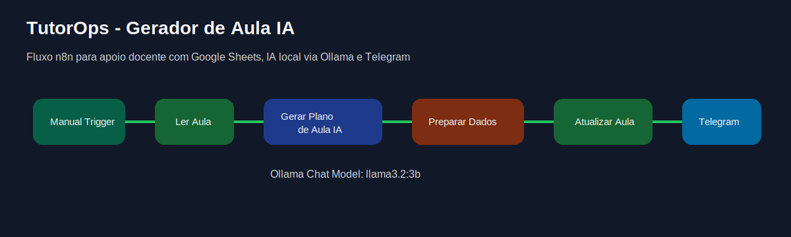

# TutorOps

**Sistema de apoio docente com n8n e IA local para cursos técnicos de TI.**

TutorOps é um workflow autoral em n8n para apoiar o planejamento, geração e registro de aulas técnicas. Ele lê uma aula cadastrada no Google Sheets, gera um plano de aula com IA local via Ollama, grava o material gerado na planilha e envia uma notificação pelo Telegram.



## Objetivo

Automatizar parte da rotina docente em cursos técnicos de Tecnologia da Informação, com foco em:

- planejamento de aulas práticas;
- geração de material didático técnico;
- criação de perguntas de fixação;
- definição de critérios de avaliação;
- registro de evidências pedagógicas;
- rastreabilidade do material gerado.

## Stack

- **n8n** para orquestração do workflow;
- **Ollama** para execução local do modelo de IA;
- **llama3.2:3b** como modelo utilizado na versão inicial;
- **Google Sheets** como base operacional;
- **Telegram Bot API** para notificação do resultado.

## Fluxo funcional

```text
Manual Trigger
→ Ler Aula
→ Gerar Plano de Aula IA
→ Ollama Chat Model
→ Preparar Atualização
→ Atualizar Aula
→ Send a text message
```

## O que o workflow faz

1. Busca no Google Sheets uma aula com status `Pendente`.
2. Envia os dados da aula para um AI Agent no n8n.
3. Usa modelo local via Ollama para gerar um plano de aula técnico.
4. Prepara os campos de atualização.
5. Atualiza a linha da aula com:
   - `status = Material gerado`
   - `material_gerado = plano de aula gerado`
6. Envia uma notificação no Telegram com tema, turma, nível e status.

## Estrutura da planilha

A planilha operacional usa as seguintes abas:

- `Aulas`
- `Relatorios`
- `Banco_Atividades`
- `Config`

Modelos CSV estão disponíveis em [`examples/`](examples/).

### Aba `Aulas`

Campos principais:

```text
id_aula
data
turma
tema
nivel
objetivo
conteudo_base
duracao
status
link_material
observacoes
material_gerado
output
```

## Status da versão

**TutorOps v1** está funcional com:

- leitura de aula no Google Sheets;
- geração de plano de aula com IA local;
- atualização da planilha;
- envio de notificação por Telegram.

Google Docs automático foi avaliado, mas ficou fora da v1 porque o OAuth do Google exige callback público HTTPS válido para uso adequado fora de `localhost`.

## Segurança

Este repositório contém uma versão sanitizada do workflow. Não publique:

- tokens de bots;
- IDs reais de chat do Telegram;
- arquivos `.env`;
- chaves JSON de service account;
- links privados;
- currículos, dados de alunos ou documentos pessoais;
- IDs reais de planilhas, pastas ou documentos privados.

Consulte [`SECURITY.md`](SECURITY.md).

## Como usar

1. Importe o arquivo [`workflows/tutorops-gerador-aula-ia.sanitized.json`](workflows/tutorops-gerador-aula-ia.sanitized.json) no n8n.
2. Configure as credenciais:
   - Google Sheets;
   - Ollama;
   - Telegram.
3. Crie a planilha com base nos CSVs de exemplo em `examples/`.
4. Ajuste no node **Ler Aula** o ID da sua planilha e a aba `Aulas`.
5. Ajuste no node **Atualizar Aula** o mesmo ID de planilha.
6. Configure o `chatId` do Telegram.
7. Cadastre uma aula com `status = Pendente`.
8. Execute o workflow.

## Prompt pedagógico

O prompt usado no AI Agent foi desenhado para reduzir erros técnicos e impedir que o modelo invente dados. Ele força:

- resposta em português do Brasil;
- linguagem técnica simples;
- foco em laboratório seguro;
- critérios observáveis;
- evidências geradas em aula;
- uso correto de comandos como `ipconfig`, `ifconfig`, `ping` e `nslookup`.

O prompt completo está documentado em [`docs/prompt.md`](docs/prompt.md).

## Registro técnico sugerido

**Título:** TutorOps: Sistema de Apoio Docente com n8n e IA Local para Cursos Técnicos de TI

**Descrição curta:** Sistema automatizado desenvolvido em n8n para apoio ao planejamento e documentação de aulas técnicas em tecnologia da informação, utilizando IA local via Ollama, Google Sheets e Telegram. A solução permite gerar planos de aula, atividades práticas, perguntas de fixação, critérios de avaliação e evidências pedagógicas, com foco em padronização docente, rastreabilidade educacional e apoio à capacitação técnica.

## Licença

Distribuído sob licença MIT. Consulte [`LICENSE`](LICENSE).
